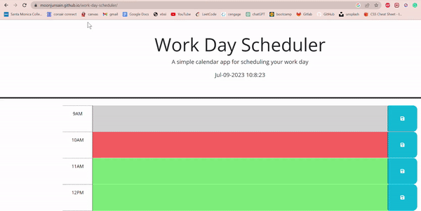

# Work Day Scheduler

## Technology Used
- html - partially given by bootcamp
- javascript - partially given by bootcamp
- css - given by bootcamp
- jQuery
- Day.js
- bootstrap - given by bootcamp
- [ezgif](https://ezgif.com/): to convert a screen recording to gif file for demo listed here.

## Description 
This is a product of a challenge provided by UC Berkeley Extension Coding Bootcamp

This is for making a daily scheduler.
It has input areas for each time from 9AM to 5PM and the user can input using their keyboard. 
The user also has option to save them on their local storage so when they reload the page it will display on the corresponding time block.

This was done while trying to accomplish following criteria:

### Acceptance Criteria
    - GIVEN I am using a daily planner to create a schedule
    1. WHEN I open the planner
    THEN the current day is displayed at the top of the calendar
    2. WHEN I scroll down
    THEN I am presented with time blocks for standard business hours of 9am to 5pm
    3. WHEN I view the time blocks for that day
    THEN each time block is color-coded to indicate whether it is in the past, present, or future
    4. WHEN I click into a time block
    THEN I can enter an event
    5. WHEN I click the save button for that time block
    THEN the text for that event is saved in local storage
    6. WHEN I refresh the page
    THEN the saved events persist

[Deployed Website](https://moonjunsain.github.io/work-day-scheduler/)

## Table of Contents

* [Installation](#installation)
* [Usage](#usage)
* [Learning Points](#learning-points)
* [Credits](#credits)
* [License](#license)

## Installation

N/A

## Usage 

Following is the demo of this app.
The user can use mouse to click the text box, type in whatever they want to save, and when they press on save button it will save the text inside that text box.
As shown in the following demo, when the user refreshes the page, it stays where the user saved information.

## Learning Points
1. The use of "this" keyword as a jQuery pointer to navigate to the element that I want to modify
2. The use of for loop to iterate by using + i for id of the element

## Credits

### June Moon
- Email: moonjunsain@gmail.com
- [Github](https://github.com/moonjunsain)
- [Linkedin](https://www.linkedin.com/in/june-moon-940538280/)

## License

MIT License

---

© 2023 edX Boot Camps LLC. Confidential and Proprietary. All Rights Reserved.